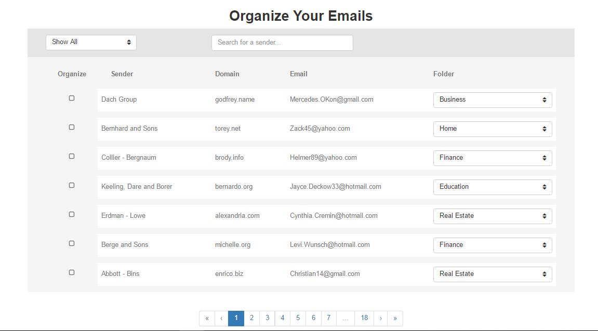
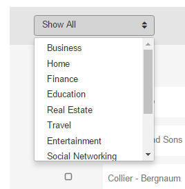
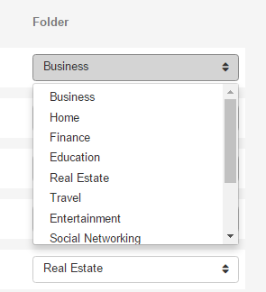
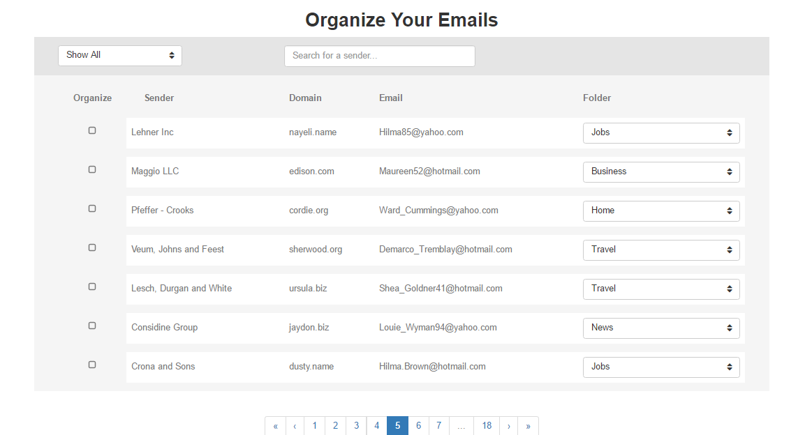
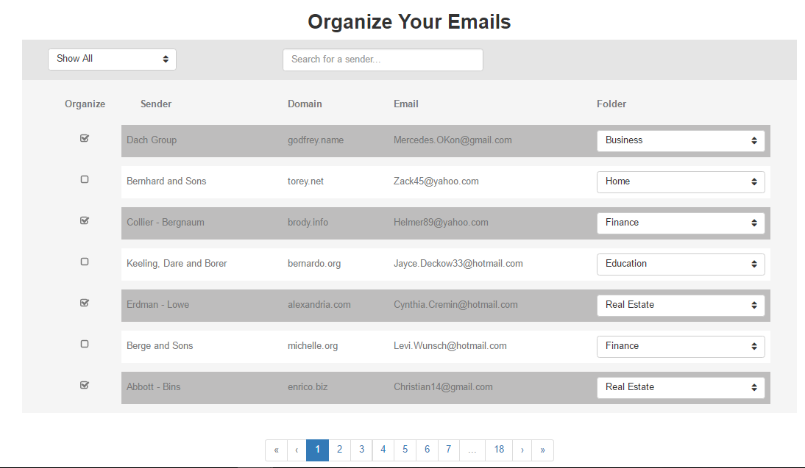

# Return Path Coding Challenge

This project is based on a [visual mockup](https://drive.google.com/file/d/0B-DG9iFOyKT2ZnlhU2pPQ3lJU1E/view?usp=sharing) and a [crowd-sourced JSON file](https://drive.google.com/file/d/0B-DG9iFOyKT2SDlOaVR3U3Z6SjQ/view?usp=sharing) that can be used for testing. Brought to you by, GapJumpers, "Employers use our technology to find untapped talent using blind auditions". 

To run this project, please do the following within the root directory:
```
npm install
```

```
npm start
```

## My Version

* #### Default Page
    

* #### Dropdown menu for the filter option
    

* #### Dropdown menu for choosing a category for a folder 
    

* #### This demonstrates pagination by showing you what the fifth page looks like 
    

* #### Example of selecting rows with the checkboxes
    

## Needs Improvements

* The selection of categories in the folder dropdown menu needs more work. Right now, if you select a category without finalizing your changes of selection (still need to implement a 'finalize' button to commit changes), the new category selection will already be set. For example, if an email from Bob is already in the Business folder and you click the checkbox and changed the folder to Real Estate without committing anything, the backend already changed it. This was done so I could get the selected category to appear on the front of the closed dropdown menu. Therefore, the backend needs more work on not destructive, overwriting the 'folder' attribute from the data that was extracted from mock_rp_data.json.
    * This meethod is destructive, so the immediately selective category overwrites the folder attribute. This has to be delayed until a 'finalize' button is pushed, and then it can be destructive to overwrite.
    ```javascript
    $scope.setEmailFolder = function(email, category)
    {
        email.folder = category;
    };
    ```
* The checkbox, when selected, does not update the 'organize' attribute within the data structure, yet. It has yet to be implemented. 
    * As of now, if a checkbox is selected, or even turned off afterward, the attribute will be stored in a new data structure:
    ```
    $scope.selection = {};    

    ```
    This is an example template of what will be stored in this data structure:
    ```
    $scope.selection = 
    {
        "sender's name": true,
        "sender's name": false,
        ...,
        "Dach Group": true,
        "Bernhard and Sons": false
    };
    ```

### What else I would liked to have done?

* I would have like to pulled all of the different folder categories from a JSON file, but I do not think I have time to do so. 

* I read in the comments of GapJumpers that for the filter folders dropdown menu, there is no need to filter the rows that matches the folder category because it deals with server side. I would have liked to have done that because I think it would have made this project more complete, but I did not have time to adventure into that route, unfortunately.

* I also would have liked to have gotten to sanitizing the external links to safe page and validations. I have never done anything like this before, so it would have been fun to implement this feature. Here is a list of links that I would've found helpful:
	* [A Journey With Trusted HTML in AngularJS](http://odetocode.com/blogs/scott/archive/2014/09/10/a-journey-with-trusted-html-in-angularjs.aspx)
	* [What is the purpose of angular-sanitize](http://stackoverflow.com/questions/33209938/what-is-the-purpose-of-angular-sanitize)
	* [Angular's Documentation of $sanitize](https://docs.angularjs.org/api/ngSanitize/service/$sanitize)

### Worth Noting:

* To get the exact colors of the Visual Mock, I downloaded the image, opened it in paint, extracted the RBG color coordinates, and then input them into [RGB to Hex Color Converter](https://www.easycalculation.com/colorconverter/rgb-coder.php) to get the hexa value to match the color coding.

* This repo, [angularUtils Pagination](https://github.com/michaelbromley/angularUtils/tree/master/src/directives/pagination), has the files that I have used for easy pagination. All credit goes to Michael Bromley.